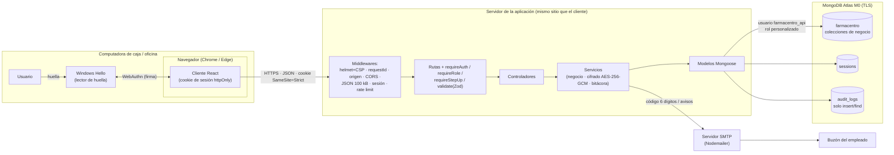
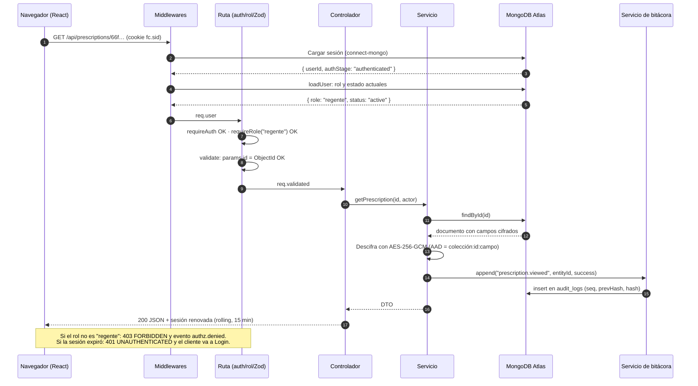
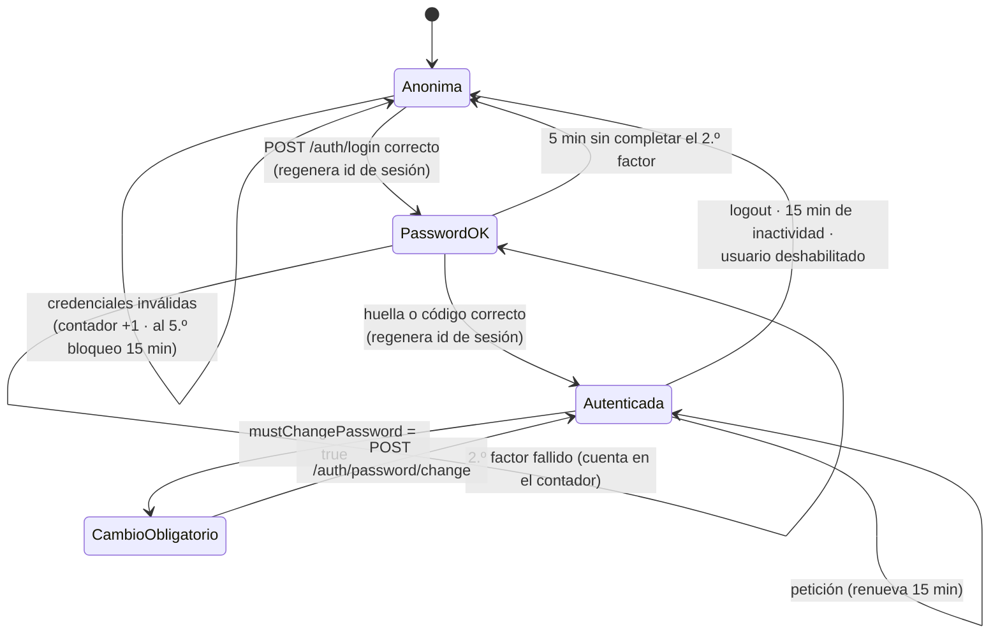
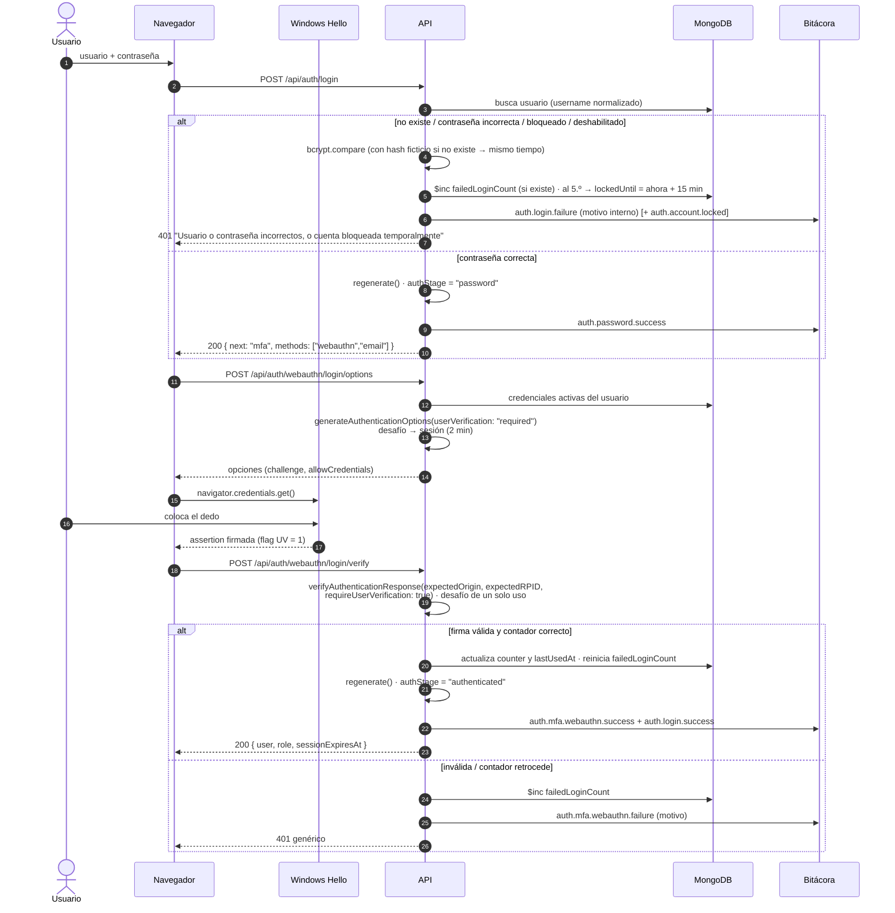
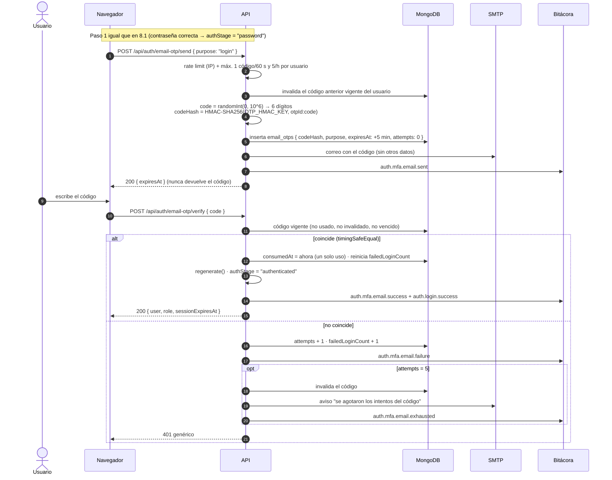
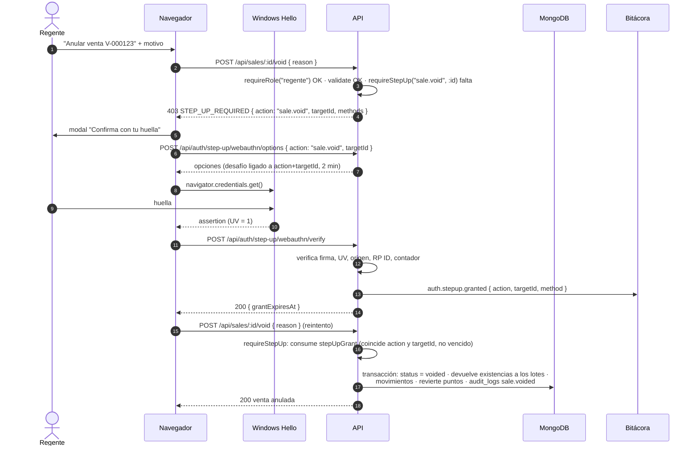

# Arquitectura del sistema de gestión de FarmaCentro

> Documento de diseño (versión inicial, 24/09/2026). Todavía no hay código; las rutas de archivo que se citan son las previstas en `estructura-repositorio.md`.
> Controles relacionados (ISO/IEC 27002:2022): 5.15, 5.17, 5.18, 8.5, 8.15, 8.24, 8.27, 8.28.

## 1. Componentes

| Componente | Tecnología | Responsabilidad | Confía en |
|---|---|---|---|
| Cliente web | React 19 + TypeScript (Vite) | Interfaz por rol, formularios, llamada a la API de WebAuthn del navegador. **No toma decisiones de seguridad**: solo oculta opciones. | Nada. Todo lo que envía se valida de nuevo en la API. |
| API | Node.js 22 + Express 5 + TypeScript | Autenticación, sesiones, segundo factor, autorización por rol, validación (Zod), reglas de negocio, cifrado de campos, bitácora. | MongoDB Atlas y el servicio de correo. |
| Base de datos | MongoDB Atlas M0 (réplica de 3 nodos) + Mongoose 9 | Persistencia, transacciones, almacén de sesiones (`sessions`) y bitácora (`audit_logs`). | — |
| Servicio de correo | Nodemailer 10 → SMTP (ver decisión pendiente D-06) | Envía códigos de 6 dígitos y avisos de seguridad (bloqueo, nueva huella, etc.). | — |
| Autenticador del usuario | Windows Hello con lector de huella (WebAuthn, autenticador de plataforma) | Verifica la huella **en el dispositivo** y firma el desafío. El servidor solo recibe la firma. | — |

### Capas de la API

`routes → middlewares → controllers → services → models`

- **routes**: declaran método, ruta, rol permitido, si exige re-autenticación, esquema Zod y límite de peticiones. No contienen lógica.
- **controllers**: traducen HTTP ↔ servicio (leen `req.validated`, llaman al servicio, devuelven el DTO). Nunca pasan `req.body` ni `req.query` a un modelo.
- **services**: reglas de negocio, transacciones, cifrado/descifrado y escritura en bitácora.
- **models**: esquemas Mongoose (`strict`, `strictQuery`, sin `autoIndex`).

## 2. Diagrama de componentes



## 3. Cómo se comunican

| Origen → destino | Protocolo | Autenticación | Notas |
|---|---|---|---|
| Navegador → API | HTTPS (en desarrollo, `http://localhost`) · JSON | Cookie de sesión `fc.sid` (`httpOnly`, `Secure`, `SameSite=Strict`, `Path=/`) | Cliente y API deben estar en el **mismo sitio**; ver §7. |
| Navegador ↔ autenticador | WebAuthn (`navigator.credentials`) vía `@simplewebauthn/browser` | Huella verificada en el dispositivo (`userVerification: "required"`) | Solo funciona en `localhost` o HTTPS. |
| API → Atlas | MongoDB Wire Protocol sobre TLS 1.2+ | Usuario `farmacentro_api` (SCRAM) con rol personalizado | IP de la API en la lista de acceso de Atlas. |
| API → SMTP | SMTP con STARTTLS/TLS | Credenciales SMTP en `.env` | Solo códigos y avisos; nunca datos de salud. |

El cliente **no guarda nada** en `localStorage` ni `sessionStorage` (ni tokens, ni datos de sesión, ni datos del usuario). El estado de sesión vive en el servidor y el cliente lo consulta con `GET /api/auth/me`.

## 4. Cadena de middlewares (orden)

| # | Middleware | Qué hace | Requisito |
|---|---|---|---|
| 1 | `app.set('trust proxy', …)` | Solo si hay proxy inverso; para registrar la IP real. | Bitácora (IP) |
| 2 | `helmet` | CSP `default-src 'self'`, `frame-ancestors 'none'`, `object-src 'none'`, `base-uri 'self'`, `form-action 'self'`, HSTS (solo con HTTPS), `Referrer-Policy: no-referrer`. | Seguridad web |
| 3 | `requestId` | Genera `X-Request-Id` (UUID) para correlacionar la respuesta, el log técnico y la bitácora. | 8.15 |
| 4 | `pino-http` | Log técnico con redacción de `cookie`, `authorization`, `password`, `code`, campos cifrados. | 8.15 |
| 5 | `verifyOrigin` | En `POST/PUT/PATCH/DELETE`: `Origin` (o, si falta, `Referer`) debe ser exactamente `CLIENT_ORIGIN`; si no → 403 y evento `security.origin.rejected`. | Verificación de origen |
| 6 | `cors` | `origin: CLIENT_ORIGIN`, `credentials: true`, métodos y cabeceras explícitos. | CORS restringido |
| 7 | `express.json({ limit: '100kb' })` + exigir `Content-Type: application/json` en escrituras | Rechaza cuerpos grandes o de otro tipo (415). | 8.28 |
| 8 | `express-session` + `connect-mongo` | Sesión en servidor, `rolling: true`, `maxAge` 15 min, `saveUninitialized: false`, `name: 'fc.sid'`. | 5.17, 8.5 |
| 9 | `loadUser` | Si hay sesión autenticada, relee el usuario (rol y estado) **en cada petición**; si está deshabilitado → destruye la sesión. Así un cambio de rol o una baja surten efecto de inmediato. | 5.18 |
| 10 | Rutas: `rateLimit` → `requireAuth` → `requireRole(...)` → `validate(schema)` → `requireStepUp(action)` → controlador | Ver `api.md`. | 5.15, 8.28 |
| 11 | `notFound` + `errorHandler` | Respuesta genérica `{ error: { code, message, requestId } }`, sin stack traces. El detalle va solo al log técnico. | Mensajes genéricos |

Mongoose se configura al arrancar con `mongoose.set('sanitizeFilter', true)`, `mongoose.set('strictQuery', true)`, `autoIndex: false` y `autoCreate: false` (los índices los crea `scripts/setup-db.ts` con un usuario distinto, porque el usuario de la API no tiene `createIndex`).

## 5. Flujo de una petición autenticada

Ejemplo: un Regente consulta el detalle de una receta (`GET /api/prescriptions/:id`).



## 6. Estados de la sesión

La sesión (`req.session`) guarda solo identificadores y marcas de tiempo, nunca datos personales:

```text
userId, authStage, mfaMethod, authenticatedAt, passwordVerifiedAt,
webauthnChallenge {value, purpose, action?, targetId?, expiresAt},
stepUpGrant {action, targetId, method, expiresAt}
```



- En `PasswordOK` solo se permiten los endpoints del segundo factor; cualquier otra ruta responde 401 `MFA_REQUIRED`.
- En `CambioObligatorio` solo se permiten `GET /auth/me`, `POST /auth/password/change` y `POST /auth/logout`.
- **Inactividad**: `rolling: true` + `cookie.maxAge = 15 min` + TTL del documento en `sessions` = 15 min. El cliente **no hace sondeos automáticos** (evitaría que la sesión expire). Muestra un aviso a los 13 min usando la hora de expiración que devuelve la API.

## 7. Despliegue y "mismo sitio"

`SameSite=Strict` obliga a que el cliente y la API estén en el mismo sitio (mismo esquema y dominio registrable). Por eso:

| Entorno | Cliente | API | Cómo se cumple |
|---|---|---|---|
| Desarrollo | Vite en `http://localhost:5173` | Express en `http://localhost:3000` | Vite hace de proxy de `/api` → el navegador solo ve `localhost:5173`. Chrome y Edge aceptan cookies `Secure` en `http://localhost`. |
| Entrega al grupo auditor | Compilado (`Farmacentro-Frontend/dist`) | Express sirve `Farmacentro-Frontend/dist` y `/api` en el **mismo origen** con HTTPS | Un solo origen: CSP `'self'`, cookie `Secure`, WebAuthn con `RP_ID` = dominio. Ver decisión pendiente D-01. |

## 8. Flujos de autenticación

### 8.1 Login con huella (WebAuthn) — primera opción



### 8.2 Login con código por correo — alternativa

Se usa cuando el usuario no tiene huella registrada (por ejemplo, el primer ingreso) o el lector no está disponible.



### 8.3 Re-autenticación para operaciones sensibles (step-up)

Aplica a: anular ventas, ajustar inventario, despachar controlados, cambiar roles y las demás marcadas en `roles-permisos.md`. El permiso que se obtiene es **de un solo uso**, está **atado a la acción y al registro** (`action` + `targetId`) y vence a los **2 minutos**.



- Si el usuario elige código por correo: `POST /api/auth/step-up/email-otp/send { action, targetId }` y `…/verify { code }`, con las mismas reglas del §8.2 (propósito `step_up`, ligado a `action` + `targetId`). Si se permite o no el correo para operaciones sensibles es la decisión pendiente **D-03**.
- Un fallo de re-autenticación genera `auth.stepup.failed` y cuenta para el bloqueo por intentos.
- El permiso no se reutiliza: una segunda anulación exige otra huella.

## 9. Criptografía

| Uso | Algoritmo | Clave / parámetro | Dónde |
|---|---|---|---|
| Contraseñas | bcrypt, costo 12 | Sal automática; máx. 72 bytes UTF-8 (límite de bcrypt) | `users.passwordHash` |
| Campos sensibles | AES-256-GCM, IV aleatorio de 12 bytes por campo y registro, etiqueta de 16 bytes | `DATA_ENC_KEY_V1` (32 bytes, `.env`); AAD = `colección:_id:campo` para que un cifrado no se pueda mover a otro registro | Ver `modelo-datos.md` |
| Búsqueda de campos cifrados (teléfono, correo del cliente) | HMAC-SHA256 ("índice ciego") | `BLIND_INDEX_KEY` | `customers.phoneHmac`, `emailHmac` |
| Códigos por correo | HMAC-SHA256 | `OTP_HMAC_KEY` | `email_otps.codeHash` |
| Firma de la cookie de sesión | HMAC (express-session) | `SESSION_SECRET` | Cookie `fc.sid` |
| Encadenamiento de la bitácora | SHA-256 | Sin clave (verificable por cualquiera) | `audit_logs.hash` |
| Transporte | TLS 1.2+ | Atlas y HTTPS de la API | — |

Cada clave tiene un solo propósito y vive en `.env`, nunca en la base de datos ni en el repositorio. Los cifrados guardan la versión de clave (`v`) para permitir rotación.

## 10. Bitácora (resumen)

- Toda escritura pasa por `auditService.append(event)`, que calcula `seq`, `prevHash` y `hash` y hace un `insert` en `audit_logs`.
- Las escrituras en la cadena se **serializan** dentro del proceso de la API (una sola instancia; ver D-09) y el índice único sobre `seq` detecta bifurcaciones.
- En operaciones con transacción (ventas, anulaciones, ajustes, despachos, cambios de rol) el registro de éxito se inserta **dentro de la misma transacción**: no puede existir la operación sin su registro. Los fallos se registran fuera de la transacción, después del `abort`.
- El detalle del algoritmo está en `modelo-datos.md` §audit_logs.

## 11. Manejo de errores

| Situación | HTTP | `code` | Mensaje al usuario |
|---|---|---|---|
| Validación Zod | 400 | `VALIDATION_ERROR` | Campos inválidos (ruta del campo y regla; nunca valores recibidos) |
| Sin sesión o expirada | 401 | `UNAUTHENTICATED` | "Tu sesión terminó. Inicia sesión de nuevo." |
| Falta segundo factor del login | 401 | `MFA_REQUIRED` | — |
| Credenciales inválidas | 401 | `INVALID_CREDENTIALS` | Genérico, igual para usuario inexistente, bloqueado o deshabilitado |
| Rol no autorizado | 403 | `FORBIDDEN` | "No tienes permiso para esta acción." |
| Falta re-autenticación | 403 | `STEP_UP_REQUIRED` | Incluye `action` y `targetId` |
| Origen no permitido | 403 | `FORBIDDEN` | Genérico |
| No existe | 404 | `NOT_FOUND` | Genérico |
| Conflicto (existencias, estado) | 409 | `CONFLICT` | Mensaje de negocio sin datos internos |
| Tipo de contenido | 415 | `UNSUPPORTED_MEDIA_TYPE` | — |
| Límite de peticiones | 429 | `RATE_LIMITED` | "Demasiados intentos. Espera un momento." |
| Error no controlado | 500 | `INTERNAL` | "Ocurrió un error. Código de referencia: {requestId}" |
