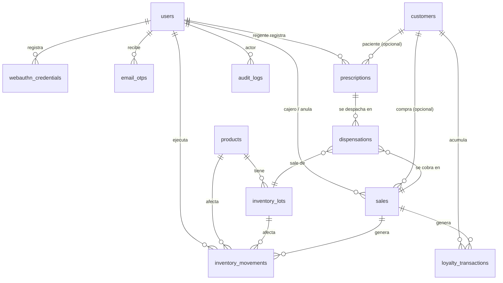

# Modelo de datos

> Documento de diseño (versión inicial, 24/09/2026). Base de datos: `farmacentro` en MongoDB Atlas M0. ODM: Mongoose 9.
> Controles relacionados: 5.34 (privacidad), 8.3 (restricción de acceso), 8.15 (registro), 8.24 (criptografía).

## 1. Convenciones

| Marca | Significado |
|---|---|
| 🔒 | Campo **cifrado** con AES-256-GCM (ver §2). |
| 🔑 | HMAC-SHA256 con clave del servidor (índice ciego o hash de código). No es reversible. |
| **P** | Dato personal (identifica o hace identificable a una persona). |
| **S** | Dato de salud o que revela salud (receta, diagnóstico, medicamento dispensado a una persona). |
| **S\*** | Salud **inferible**: no es un dato clínico, pero combinado con el cliente revela tratamientos (por ejemplo, el detalle de una venta con cliente). |

- Todos los documentos tienen `_id: ObjectId`, `createdAt` y `updatedAt` (`timestamps: true`) salvo que se indique lo contrario. Las fechas se guardan en UTC (`Date`).
- Montos en **centavos de quetzal** como enteros (`Int32`/`Number` entero), para evitar errores de redondeo. Los precios incluyen IVA.
- Esquemas Mongoose con `strict: 'throw'` (rechaza campos no definidos), `strictQuery: true` y `sanitizeFilter` global.
- `autoIndex: false`: los índices los crea `scripts/setup-db.ts` con el usuario `farmacentro_migrator`.
- Borrado: la API **no borra** documentos de negocio (no tiene el privilegio `remove`, salvo en `sessions`). Las bajas son lógicas (`status`) y los datos personales se anonimizan con `update` cuando el cliente retira su consentimiento.

## 2. Formato de los campos cifrados

Cada campo 🔒 se guarda como un subdocumento:

```text
{ v: Int (versión de clave), iv: Binary(12 bytes), tag: Binary(16 bytes), ct: Binary }
```

- Algoritmo AES-256-GCM (`node:crypto`), **IV aleatorio por campo y por registro** (`crypto.randomBytes(12)`), nunca reutilizado.
- AAD (datos autenticados adicionales) = `"<colección>:<_id>:<campo>"`. Por eso el `_id` se genera en la aplicación **antes** de cifrar. Si alguien copia un cifrado a otro registro o a otro campo, el descifrado falla.
- Los valores estructurados (por ejemplo, la lista de medicamentos de una receta) se serializan a JSON antes de cifrar.
- Clave activa: `DATA_ENC_KEY_V<n>` en `.env`; `DATA_ENC_ACTIVE_VERSION` indica con cuál se cifra. Para descifrar se usa la versión guardada en `v`.
- Un campo cifrado no se puede buscar ni ordenar. Donde hace falta buscar se agrega un índice ciego 🔑 (`HMAC-SHA256(BLIND_INDEX_KEY, valor_normalizado)`).

## 3. Diagrama de relaciones



## 4. Colecciones

### 4.1 `users` — empleados

| Campo | Tipo | Reglas | Clasif. |
|---|---|---|---|
| `username` | String | Único, minúsculas, 3–32, `[a-z0-9._-]` | P |
| `fullName` | String | 3–100 | P |
| `email` | String | Correo válido, único; destino de códigos y avisos | P |
| `role` | String enum | `admin` · `regente` · `cajero` · `bodeguero` · `auditor` | — |
| `status` | String enum | `active` · `disabled` | — |
| `passwordHash` | String | bcrypt, costo 12 | — (secreto) |
| `passwordChangedAt` | Date | | — |
| `mustChangePassword` | Boolean | `true` al crear o al restablecer | — |
| `failedLoginCount` | Int | Se incrementa con `$inc` atómico; se reinicia al entrar | — |
| `lockedUntil` | Date \| null | `ahora + 15 min` al llegar a 5 fallos | — |
| `lastLoginAt` | Date \| null | | — |
| `lastLoginIp` | String \| null | | P |
| `createdBy` / `updatedBy` | ObjectId → users | | — |

Índices: `{ username: 1 }` único · `{ email: 1 }` único · `{ role: 1, status: 1 }`.
Nunca se devuelve `passwordHash` (el esquema lo marca `select: false`).

### 4.2 `webauthn_credentials` — huellas registradas

| Campo | Tipo | Reglas | Clasif. |
|---|---|---|---|
| `userId` | ObjectId → users | | — |
| `credentialId` | String (base64url) | Único | — |
| `publicKey` | Binary | Clave pública COSE (no es secreta; **no hay datos biométricos**) | — |
| `counter` | Int | Contador de firmas; si retrocede se rechaza y se registra | — |
| `transports` | [String] | `internal`, `usb`, … | — |
| `deviceType` / `backedUp` | String / Boolean | Informativos | — |
| `nickname` | String | 1–50, p. ej. "Caja 1" | — |
| `lastUsedAt` | Date \| null | | — |
| `revokedAt` / `revokedBy` | Date / ObjectId \| null | Baja lógica | — |

Índices: `{ credentialId: 1 }` único · `{ userId: 1, revokedAt: 1 }`.

### 4.3 `email_otps` — códigos de 6 dígitos

| Campo | Tipo | Reglas | Clasif. |
|---|---|---|---|
| `userId` | ObjectId → users | | — |
| `purpose` | String enum | `login` · `step_up` | — |
| `action` / `targetId` | String / String \| null | Solo en `step_up`: acción y registro a los que queda ligado | — |
| `codeHash` 🔑 | String | `HMAC-SHA256(OTP_HMAC_KEY, "<_id>:<código>")`. **Nunca se guarda el código.** | — |
| `attempts` | Int | Máx. 5; al llegar se invalida | — |
| `expiresAt` | Date | `createdAt + 5 min` | — |
| `consumedAt` | Date \| null | Un solo uso | — |
| `invalidatedAt` | Date \| null | Al generar uno nuevo o al agotar intentos | — |
| `requestIp` | String | | P |

Índices: `{ userId: 1, purpose: 1, createdAt: -1 }` · TTL `{ expiresAt: 1 }` con `expireAfterSeconds: 86400` (se borran 24 h después de vencer; el borrado lo hace el servidor de MongoDB, no la API).

### 4.4 `sessions` — almacén de `connect-mongo`

| Campo | Tipo | Notas |
|---|---|---|
| `_id` | String | Id de sesión (no el valor firmado de la cookie) |
| `session` | String (JSON) | `userId`, `authStage`, `mfaMethod`, `authenticatedAt`, `webauthnChallenge`, `stepUpGrant`, `cookie` |
| `expires` | Date | Se renueva con cada petición (`rolling`) |

Índice TTL `{ expires: 1 }` con `expireAfterSeconds: 0`, creado por `setup-db.ts` (`autoRemove: 'disabled'` en connect-mongo, porque la API no tiene `createIndex`).

### 4.5 `products` — catálogo

| Campo | Tipo | Reglas | Clasif. |
|---|---|---|---|
| `sku` | String | Único, 3–20, `[A-Z0-9-]` | — |
| `name` | String | 2–120 | — |
| `activeIngredient` | String \| null | 0–120 | — |
| `presentation` | String | p. ej. "Caja 10 tabletas 500 mg" | — |
| `category` | String enum | `medicamento` · `cuidado_personal` · `otros` | — |
| `unitPriceCents` | Int | > 0 | — |
| `isControlled` | Boolean | Solo lo cambia el Regente con re-autenticación | — |
| `minStock` | Int | ≥ 0; alerta de existencias bajas | — |
| `status` | String enum | `active` · `inactive` | — |
| `createdBy` / `updatedBy` | ObjectId → users | | — |

Índices: `{ sku: 1 }` único · `{ name: 1 }` · `{ isControlled: 1, status: 1 }`.
Las existencias **no** se guardan en el producto: se calculan sumando los lotes (evita dos fuentes de verdad).

### 4.6 `inventory_lots` — lotes

| Campo | Tipo | Reglas | Clasif. |
|---|---|---|---|
| `productId` | ObjectId → products | | — |
| `lotNumber` | String | 1–40 | — |
| `expiresAt` | Date | Fecha de vencimiento | — |
| `quantity` | Int | ≥ 0 (validado en la transacción) | — |
| `supplier` | String \| null | Droguería | — |
| `receivedAt` | Date | | — |
| `receivedBy` | ObjectId → users | | — |

Índices: `{ productId: 1, lotNumber: 1 }` único · `{ productId: 1, expiresAt: 1 }` (selección FEFO: primero el que vence antes) · `{ expiresAt: 1 }` (reporte de vencimientos).
Los lotes vencidos no se venden (la API los excluye) y se dan de baja con un ajuste.

### 4.7 `inventory_movements` — kardex (solo inserción)

| Campo | Tipo | Reglas | Clasif. |
|---|---|---|---|
| `productId` / `lotId` | ObjectId | | — |
| `type` | String enum | `receipt` · `sale` · `sale_void` · `adjustment` · `dispensation` | — |
| `quantityDelta` | Int | Con signo (≠ 0) | — |
| `balanceAfter` | Int | Existencia del lote después del movimiento | — |
| `reasonCode` | String enum \| null | Ajustes: `damaged` · `expired` · `count_correction` · `loss` · `other` | — |
| `reason` | String \| null | 10–300, obligatorio en ajustes | — |
| `refType` / `refId` | String / ObjectId \| null | `sale`, `dispensation`… | — |
| `userId` | ObjectId → users | | — |
| `stepUpMethod` | String \| null | `webauthn` · `email_otp` (ajustes) | — |

Índices: `{ productId: 1, createdAt: -1 }` · `{ type: 1, createdAt: -1 }` · `{ lotId: 1, createdAt: -1 }`.
Privilegios de la API: solo `insert` y `find` (igual que la bitácora): el historial de inventario no se puede reescribir.

### 4.8 `sales` — ventas de mostrador

| Campo | Tipo | Reglas | Clasif. |
|---|---|---|---|
| `saleNumber` | String | `V-000001`, desde `counters` | — |
| `cashierId` | ObjectId → users | Quien cobró | — |
| `customerId` | ObjectId → customers \| null | Opcional | P (vínculo) |
| `items[]` | Array | `{ productId, lotId, sku, name, quantity, unitPriceCents, lineTotalCents }` (instantánea del precio al vender) | S\* si hay cliente |
| `totalCents` | Int | Calculado en el servidor, nunca recibido del cliente | — |
| `payment` | Objeto | `{ method: 'cash' \| 'card_simulated', amountReceivedCents?, changeCents?, authorizationRef? }` | — |
| `payment.authorizationRef` | String | `SIM-` + 10 caracteres aleatorios. **Nunca** número de tarjeta, vencimiento, CVV, titular ni últimos 4 dígitos | — |
| `pointsEarned` | Int | | — |
| `dispensationId` | ObjectId \| null | Si la venta proviene de un despacho con receta | S |
| `status` | String enum | `completed` · `voided` | — |
| `void` | Objeto \| null | `{ voidedAt, voidedBy, reason (10–300), stepUpMethod }` | — |

Índices: `{ saleNumber: 1 }` único · `{ cashierId: 1, createdAt: -1 }` · `{ status: 1, createdAt: -1 }` · `{ customerId: 1, createdAt: -1 }` (parcial, solo si existe).

### 4.9 `customers` — clientes de fidelización

Se recoge lo mínimo: nombre y un medio de contacto (teléfono o correo), más el consentimiento.

| Campo | Tipo | Reglas | Clasif. |
|---|---|---|---|
| `fullName` | String | 3–100 (en claro, ver decisión D-12) | P |
| `phone` 🔒 | Cifrado | 8 dígitos (Guatemala) | P |
| `phoneHmac` 🔑 | String | Índice ciego para buscar por teléfono | P |
| `email` 🔒 | Cifrado \| null | | P |
| `emailHmac` 🔑 | String \| null | Índice ciego | P |
| `consent` | Objeto | `{ accepted: true, noticeVersion, acceptedAt, recordedBy, channel: 'mostrador' }` — **obligatorio** para crear | P |
| `consentWithdrawnAt` | Date \| null | Al retirar el consentimiento se anonimizan nombre y contacto | — |
| `pointsBalance` | Int | ≥ 0 | — |
| `status` | String enum | `active` · `withdrawn` | — |
| `createdBy` | ObjectId → users | | — |

Índices: `{ phoneHmac: 1 }` único parcial (solo `status: 'active'`) · `{ emailHmac: 1 }` único parcial · `{ status: 1 }`.
No se recoge DPI, fecha de nacimiento ni dirección (minimización, ISO/IEC 27701).

### 4.10 `loyalty_transactions` — movimientos de puntos (solo inserción)

| Campo | Tipo | Reglas | Clasif. |
|---|---|---|---|
| `customerId` | ObjectId → customers | | P (vínculo) |
| `type` | String enum | `earn` · `void_reversal` (y `redeem` si se aprueba D-14) | — |
| `points` | Int | Con signo | — |
| `saleId` | ObjectId → sales | | — |
| `userId` | ObjectId → users | | — |

Índices: `{ customerId: 1, createdAt: -1 }` · `{ saleId: 1 }`.

### 4.11 `prescriptions` — recetas (solo Regente)

Colección separada del resto de datos comerciales (ISO 27799). Todo lo clínico va cifrado; en claro solo queda lo necesario para operar.

| Campo | Tipo | Reglas | Clasif. |
|---|---|---|---|
| `folio` | String | `R-000001`, desde `counters` | — |
| `customerId` | ObjectId → customers \| null | Opcional (paciente fidelizado) | P (vínculo) |
| `patientName` 🔒 | Cifrado | 3–100 | P, S |
| `doctorName` 🔒 | Cifrado | 3–100 | P |
| `doctorLicense` 🔒 | Cifrado | Número de colegiado, 1–20 | P |
| `issuedAt` | Date | Fecha de emisión (no futura; vigencia en D-16) | — |
| `items` 🔒 | Cifrado (JSON) | `[{ productId, productName, dosage, quantityPrescribed }]` | S |
| `notes` 🔒 | Cifrado \| null | Indicaciones, 0–500 | S |
| `hasControlled` | Boolean | Si incluye algún producto controlado (para exigir re-autenticación sin descifrar) | S\* |
| `status` | String enum | `registered` · `partially_dispensed` · `dispensed` · `cancelled` | — |
| `registeredBy` | ObjectId → users (Regente) | | — |
| `cancel` | Objeto \| null | `{ cancelledAt, cancelledBy, reason }` | — |

Índices: `{ folio: 1 }` único · `{ status: 1, createdAt: -1 }` · `{ customerId: 1 }` (parcial).
Cada lectura del detalle descifrado genera `prescription.viewed` en la bitácora.

### 4.12 `dispensations` — despachos con receta (solo inserción)

| Campo | Tipo | Reglas | Clasif. |
|---|---|---|---|
| `prescriptionId` | ObjectId → prescriptions | | S |
| `saleId` | ObjectId → sales | Venta que se generó | — |
| `items[]` | Array | `{ productId, lotId, quantity, isControlled }` | S |
| `pharmacistId` | ObjectId → users (Regente) | | — |
| `stepUpMethod` | String \| null | Obligatorio si hay controlados | — |

Índices: `{ prescriptionId: 1 }` · `{ createdAt: -1 }` · `{ 'items.productId': 1, createdAt: -1 }`.

### 4.13 `counters` — correlativos

| Campo | Tipo | Notas |
|---|---|---|
| `_id` | String | `sale`, `prescription` |
| `seq` | Int | `findOneAndUpdate({ $inc: { seq: 1 } })` dentro de la transacción |

### 4.14 `audit_logs` — bitácora inmodificable

| Campo | Tipo | Reglas | Requisito CLAUDE.md |
|---|---|---|---|
| `seq` | Long | Correlativo, empieza en 0 (génesis). Índice **único** | — |
| `timestamp` | Date | UTC, lo pone el servidor | fecha en UTC |
| `actor.userId` | ObjectId \| null | `null` si es anónimo (login fallido de usuario inexistente) | usuario |
| `actor.username` | String \| null | Para login fallido: el nombre intentado, recortado a 32 caracteres | usuario |
| `actor.role` | String \| null | Rol **en el momento** del evento | rol |
| `action` | String | Catálogo en `roles-permisos.md` §4 (p. ej. `sale.voided`) | acción |
| `entity` | String \| null | `user`, `sale`, `prescription`, … | entidad |
| `entityId` | String \| null | | id de la entidad |
| `result` | String enum | `success` · `failure` · `denied` | resultado |
| `details` | Objeto | Pequeño y **sin datos sensibles** (nunca contraseñas, códigos, datos de receta ni contacto del cliente). Ej.: `{ reason, fromRole, toRole, stepUpMethod, rows }` | — |
| `ip` | String | IP del cliente (respetando `trust proxy`) | IP |
| `userAgent` | String | Recortado a 256 caracteres | user agent |
| `requestId` | String | Correlación con el log técnico | — |
| `prevHash` | String (hex, 64) | `hash` del registro `seq - 1`; génesis = 64 ceros | hash del anterior |
| `hash` | String (hex, 64) | Ver algoritmo | — |

Sin `updatedAt` (no hay actualizaciones). Índices: `{ seq: 1 }` único · `{ timestamp: -1 }` · `{ action: 1, timestamp: -1 }` · `{ 'actor.userId': 1, timestamp: -1 }` · `{ result: 1, timestamp: -1 }` · `{ entity: 1, entityId: 1 }`.

**Algoritmo de encadenamiento**

```text
canonical = JSON.stringify([
  seq, timestamp.toISOString(), actor.userId, actor.username, actor.role,
  action, entity, entityId, result, canonicalJson(details),
  ip, userAgent, requestId, prevHash
])                                   // arreglo con orden fijo → serialización determinista
hash = SHA-256(canonical) en hexadecimal
canonicalJson(x) = JSON con llaves ordenadas alfabéticamente, sin espacios
```

1. Se toma el candado de la cadena (en memoria; una sola instancia de la API).
2. Se lee el último registro (`sort({ seq: -1 }).limit(1)`); `prevHash = último.hash`, `seq = último.seq + 1`.
3. Se calcula `hash` y se hace `insert`. Si hay transacción, el `insert` va dentro de ella y el candado se suelta después del `commit`.
4. Si el índice único de `seq` rechaza el `insert` (otra instancia escribió antes), se aborta y se reintenta.

**Verificación** (`GET /api/audit/verify` y `scripts/verify-audit-chain.ts`): recorre por `seq` ascendente y comprueba que (a) `seq` no tenga huecos, (b) `prevHash` sea igual al `hash` anterior y (c) el `hash` recalculado coincida. Devuelve el primer `seq` roto.

**Qué detecta y qué no**: detecta cualquier cambio, inserción intermedia o borrado dentro de la cadena. No detecta, por sí solo, que se borren los **últimos** registros ni que alguien con privilegios de administrador en Atlas reescriba la cadena completa; para eso se propone un "ancla" (el `seq` y `hash` más recientes) que se entrega al grupo auditor fuera del sistema (decisión D-10).

**Retención**: el entregable pide 12 meses. Como la API no puede borrar, en el prototipo no se purga nada; la purga queda "solo documentada".

## 5. Clasificación resumida

| Colección | Datos personales | Datos de salud | Campos cifrados | API: privilegios |
|---|---|---|---|---|
| `users` | Sí (empleados) | No | — | find, insert, update |
| `webauthn_credentials` | No (clave pública) | No | — | find, insert, update |
| `email_otps` | IP | No | — (HMAC) | find, insert, update |
| `sessions` | No | No | — | find, insert, update, remove |
| `products` | No | No | — | find, insert, update |
| `inventory_lots` | No | No | — | find, insert, update |
| `inventory_movements` | No | No | — | **find, insert** |
| `sales` | Vínculo a cliente | Inferible | — | find, insert, update |
| `customers` | Sí | No | `phone`, `email` | find, insert, update |
| `loyalty_transactions` | Vínculo a cliente | No | — | **find, insert** |
| `prescriptions` | Sí | **Sí** | `patientName`, `doctorName`, `doctorLicense`, `items`, `notes` | find, insert, update |
| `dispensations` | Vínculo | **Sí** | — (solo ids) | **find, insert** |
| `counters` | No | No | — | find, insert, update |
| `audit_logs` | Usuario, IP | No (solo ids) | — | **find, insert** |

## 6. Usuarios y roles de MongoDB

En Atlas los roles personalizados se crean desde la interfaz (Database Access → Custom Roles), la Atlas CLI o la Admin API; el comando `createRole` no está disponible para los usuarios de un clúster Atlas. Atlas M0 admite roles personalizados (los cambios tardan hasta 30 s en aplicarse).

| Usuario | Rol | Privilegios | Quién lo usa |
|---|---|---|---|
| `farmacentro_api` | Personalizado `farmacentroApi` | Exactamente los de la última columna de §5, por colección, en la base `farmacentro`. **Sin** `remove` (salvo `sessions`), `createIndex`, `dropCollection`, `collMod` ni acceso a otras bases. | La API (`MONGODB_URI` en `server/.env`) |
| `farmacentro_migrator` | Integrados `readWrite` + `dbAdmin` sobre `farmacentro` | Crear colecciones e índices, sembrar datos, respaldos. | Solo `scripts/` desde la máquina del equipo (`MONGODB_URI_ADMIN`, fuera de `server/.env`) |
| `farmacentro_audit_reader` | Personalizado `auditReader` | `find` sobre `audit_logs` únicamente | Grupo auditor, para verificar la cadena por su cuenta (decisión D-11) |

**Evidencia prevista**: captura de la definición del rol en Atlas y la salida de `scripts/check-db-privileges.ts`, que con el usuario de la API ejecuta `connectionStatus` con `showPrivileges: true` e intenta un `updateOne` y un `deleteOne` sobre `audit_logs`, esperando el error `Unauthorized`.

## 7. Transacciones

Usan `session.withTransaction()` (Atlas M0 es un conjunto de réplicas de 3 nodos, así que las admite) con `readConcern: 'snapshot'` y `writeConcern: 'majority'`:

| Operación | Documentos que cambian en una sola transacción |
|---|---|
| Venta | `counters` · `inventory_lots` (FEFO, valida existencia ≥ cantidad) · `inventory_movements` · `sales` · `customers.pointsBalance` · `loyalty_transactions` · `audit_logs` |
| Anulación | `sales.status/void` · `inventory_lots` · `inventory_movements` (`sale_void`) · `customers` · `loyalty_transactions` (`void_reversal`) · `audit_logs` |
| Entrada de mercadería | `inventory_lots` (crea o suma) · `inventory_movements` · `audit_logs` |
| Ajuste de inventario | `inventory_lots` · `inventory_movements` · `audit_logs` |
| Despacho con receta | `counters` · `inventory_lots` · `inventory_movements` · `sales` · `dispensations` · `prescriptions.status` · `audit_logs` |
| Cambio de rol / baja de usuario | `users` · `audit_logs` |

## 8. Facturación: `billing_parties` y `sales.billing` (agregado el 25/09/2026)

Al cobrar se elige cómo se identifica al comprador en el comprobante: **CF** (consumidor final), **NIT** o **DPI** (CUI). Desde **Q2,500.00** no se permite CF (regla de la SAT).

### `billing_parties` — compradores identificados

| Campo | Tipo | Reglas | Clasif. |
|---|---|---|---|
| `type` | String enum | `NIT` · `CUI` | — |
| `taxId` 🔒 | Cifrado | NIT validado por dígito verificador (0–9 o K); CUI de 13 dígitos con dígito verificador y departamento 01–22 | P |
| `taxIdHmac` 🔑 | String | Índice ciego `HMAC(BLIND_INDEX_KEY, "<type>:<número>")` | P |
| `name` | String | 3–150; se pide solo la primera vez que se usa ese NIT/DPI | P |
| `createdBy` | ObjectId → users | | — |

Índice: `{ type: 1, taxIdHmac: 1 }` único. Privilegios de la API: `find`, `insert`, `update`.

### `sales.billing` — instantánea en la venta

`{ type: 'CF' | 'NIT' | 'CUI', partyId, name, taxIdDisplay }`. `taxIdDisplay` guarda lo que se imprime: el **NIT completo** (como en una factura) o el **DPI enmascarado** (`XXXX XXXXX 0101`). El DPI completo nunca se guarda en `sales`. Las ventas anteriores a este cambio se muestran como CF.
