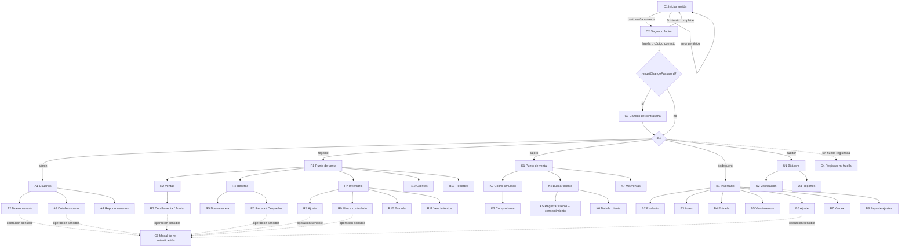

# Pantallas del frontend

> Documento de diseño (versión inicial, 24/09/2026). Cliente React 19 + TypeScript + React Router.
> Recordatorio: ocultar una opción en el frontend es solo comodidad; la API vuelve a verificar rol y re-autenticación.

## 1. Reglas comunes de interfaz

- **Sin almacenamiento en el navegador**: nada en `localStorage`, `sessionStorage` ni IndexedDB. El usuario y su rol se piden a `GET /api/auth/me` al cargar la aplicación y se guardan solo en memoria (contexto de React).
- **Sin `dangerouslySetInnerHTML`** ni HTML construido con cadenas; todo texto se muestra con JSX (escapado por React). Regla de ESLint que lo prohíbe.
- **Aviso de inactividad**: a los 13 minutos sin actividad aparece "Tu sesión se cerrará en 2 minutos" con botón "Seguir trabajando" (hace una petición que renueva la sesión). A los 15 minutos el cliente limpia su estado y muestra Login con el mensaje "Tu sesión se cerró por inactividad". No hay sondeos automáticos.
- **Respuesta 401** en cualquier llamada → limpiar estado y ir a Login. **403 `STEP_UP_REQUIRED`** → abrir el modal de re-autenticación y reintentar una vez. **403 `FORBIDDEN`** → pantalla "Acceso denegado".
- **Errores**: mensaje genérico y el `requestId` para reportarlo; nunca detalles técnicos.
- **Datos sensibles en pantalla**: el teléfono del cliente se muestra enmascarado salvo en su detalle; la receta descifrada solo en su pantalla de detalle y se descarta del estado al salir.
- Menú lateral generado a partir de `permissions` de `/auth/me`.

## 2. Pantallas comunes (todos los roles)

| Id | Pantalla | Ruta | Descripción | Endpoints |
|---|---|---|---|---|
| C1 | Iniciar sesión | `/login` | Usuario y contraseña. Mensaje de error genérico. | 2 |
| C2 | Segundo factor | `/login/segundo-factor` | Botón "Usar mi huella" y enlace "Enviarme un código por correo". Si el usuario no tiene huella, solo código. Campo de 6 dígitos con cuenta regresiva de 5 min y "Reenviar" habilitado a los 60 s. | 3–6 |
| C3 | Cambio de contraseña obligatorio | `/cambiar-contrasena` | Aparece si `mustChangePassword`. Muestra las reglas (12+ caracteres, no contener el usuario). | 9 |
| C4 | Registrar mi huella | `/mi-cuenta/huellas/nueva` | Sugerida después del primer ingreso ("Registra tu huella para operar más rápido y seguro"). Pide re-autenticación con código. | 10–16 |
| C5 | Mi cuenta | `/mi-cuenta` | Datos propios, cambiar contraseña, lista de huellas registradas (revocar). | 8, 9, 14, 17 |
| C6 | Modal de re-autenticación | (modal) | "Esta operación requiere confirmar tu identidad": muestra la acción (p. ej. "Anular venta V-000123"), botón de huella y, si D-03 lo permite, código por correo. | 10–13 |
| C7 | Aviso de sesión por expirar | (modal) | Ver §1. | 8 |
| C8 | Acceso denegado | `/acceso-denegado` | Mensaje genérico y botón a la pantalla de inicio del rol. | — |
| C9 | No encontrado / Error | `/404`, `/error` | Genéricas, con `requestId` cuando exista. | — |

## 3. Pantallas por rol

### 3.1 Administrador

| Id | Pantalla | Ruta | Descripción | Endpoints |
|---|---|---|---|---|
| A1 | Usuarios (inicio) | `/usuarios` | Tabla con filtros por rol y estado; indicadores de bloqueado y de huella registrada. | 18 |
| A2 | Nuevo usuario | `/usuarios/nuevo` | Formulario + re-autenticación. Al guardar, muestra la contraseña temporal **una sola vez** con aviso "cópiala ahora". | 20 |
| A3 | Detalle de usuario | `/usuarios/:id` | Datos, huellas, y acciones: editar, cambiar rol, deshabilitar/habilitar, desbloquear, restablecer contraseña, revocar huella. Cada acción pide motivo y re-autenticación. Los botones sobre la propia cuenta aparecen deshabilitados. | 19, 21–26 |
| A4 | Reporte de usuarios y roles | `/reportes/usuarios-roles` | Vista del reporte (sin exportación). | 56 |

### 3.2 Regente

| Id | Pantalla | Ruta | Descripción | Endpoints |
|---|---|---|---|---|
| R1 | Punto de venta (inicio) | `/pos` | Igual que K1. Los productos controlados aparecen con distintivo y el botón "Despachar con receta" lleva a R6. | 27, 37, 42 |
| R2 | Ventas | `/ventas` | Todas las ventas con filtros de fecha y estado. | 38 |
| R3 | Detalle de venta | `/ventas/:id` | Ítems, pago simulado, estado. Botón "Anular venta" → motivo → re-autenticación. | 39, 40 |
| R4 | Recetas | `/recetas` | Lista por folio, fecha y estado (sin datos clínicos). | 47 |
| R5 | Nueva receta | `/recetas/nueva` | Paciente (opcional: vincular cliente), médico, colegiado, fecha, medicamentos con dosis, notas. | 42, 27, 49 |
| R6 | Detalle y despacho de receta | `/recetas/:id` | Muestra la receta descifrada (se registra el acceso). Despacho: cantidades por medicamento (tope: lo prescrito menos lo ya despachado), cobro simulado, re-autenticación si hay controlados. Botón "Anular receta" con motivo. | 48, 50, 51 |
| R7 | Inventario | `/inventario` | Productos y existencias; filtro de controlados y existencias bajas. | 27, 28, 32 |
| R8 | Ajuste de inventario | `/inventario/ajustes/nuevo` | Lote, cantidad (+/−), código y motivo, re-autenticación. Puede ajustar controlados. | 32, 36 |
| R9 | Producto (marca de controlado) | `/inventario/productos/:id` | Vista del producto; el Regente solo ve el interruptor "Medicamento controlado" (motivo + re-autenticación). | 28, 31 |
| R10 | Entrada de mercadería | `/inventario/entradas/nueva` | Igual que B4. | 35 |
| R11 | Vencimientos | `/inventario/vencimientos` | Igual que B5. | 33 |
| R12 | Clientes | `/clientes` | Igual que K4–K6, más "Registrar retiro de consentimiento". | 41–46 |
| R13 | Reportes | `/reportes` | Anulaciones, ajustes y despachos de controlados (sin exportación). | 57–59 |

### 3.3 Cajero

| Id | Pantalla | Ruta | Descripción | Endpoints |
|---|---|---|---|---|
| K1 | Punto de venta (inicio) | `/pos` | Búsqueda de productos, carrito, cliente de fidelización opcional (búsqueda por teléfono). Los controlados no se pueden agregar (mensaje "Requiere despacho por el Regente"). | 27, 42 |
| K2 | Cobro (modal) | (modal) | Efectivo (monto recibido, cambio) o "Tarjeta (simulada)": **no hay campos de tarjeta**; un botón "Aprobar pago simulado" genera la referencia `SIM-…`. | 37 |
| K3 | Comprobante | `/ventas/:id/comprobante` | Número de venta, ítems, total, referencia simulada, puntos ganados. Imprimible. | 39 |
| K4 | Buscar cliente | `/clientes` | Por teléfono o correo; resultado enmascarado. | 42 |
| K5 | Registrar cliente | `/clientes/nuevo` | Nombre, teléfono, correo opcional y el **aviso de privacidad** visible completo con casilla obligatoria "El cliente leyó y acepta el aviso" (el botón Guardar se habilita solo al marcarla; la API lo vuelve a exigir). | 41, 43 |
| K6 | Detalle de cliente | `/clientes/:id` | Contacto, puntos y corrección de datos. | 44, 45 |
| K7 | Mis ventas del día | `/mis-ventas` | Solo propias del día; sin opción de anular (se muestra "Solicita la anulación al Regente"). | 38, 39 |

### 3.4 Bodeguero

| Id | Pantalla | Ruta | Descripción | Endpoints |
|---|---|---|---|---|
| B1 | Inventario (inicio) | `/inventario` | Productos, existencias, existencias bajas. | 27 |
| B2 | Nuevo / editar producto | `/inventario/productos/nuevo`, `/inventario/productos/:id` | Datos del catálogo. El campo "controlado" es solo lectura. | 28–30 |
| B3 | Lotes | `/inventario/lotes` | Lotes por producto con vencimiento y existencia. | 32 |
| B4 | Entrada de mercadería | `/inventario/entradas/nueva` | Producto, lote, vencimiento, cantidad, droguería, documento. | 35 |
| B5 | Vencimientos | `/inventario/vencimientos` | Lotes que vencen en N días y vencidos con existencia. | 33 |
| B6 | Ajuste de inventario | `/inventario/ajustes/nuevo` | Solo lotes de productos no controlados; motivo + re-autenticación. | 32, 36 |
| B7 | Kardex | `/inventario/movimientos` | Movimientos con filtros. | 34 |
| B8 | Reporte de ajustes | `/reportes/ajustes` | Sin exportación. | 58 |

### 3.5 Auditor

| Id | Pantalla | Ruta | Descripción | Endpoints |
|---|---|---|---|---|
| U1 | Bitácora (inicio) | `/bitacora` | Filtros (fechas, acción, usuario, resultado, entidad), tabla paginada, detalle de cada registro con `seq`, `prevHash` y `hash`. Botón "Exportar CSV". | 52, 53 |
| U2 | Verificación de integridad | `/bitacora/verificacion` | Botón "Verificar cadena": resultado (íntegra / rota en `seq` N), total verificado, último `seq` y `hash` (para anotar como ancla). | 54 |
| U3 | Reportes | `/reportes` | Pestañas: intentos fallidos, usuarios y roles, anulaciones, ajustes, despachos de controlados. Cada una con rango de fechas y "Exportar CSV". | 55–59 |

## 4. Navegación

Desde cualquier pantalla autenticada: menú de usuario → C5 Mi cuenta · Cerrar sesión (→ C1). Una ruta de otro rol escrita a mano en la barra de direcciones lleva a C8 (y la API respondería 403 de todos modos).
